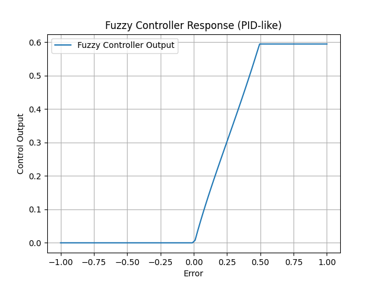
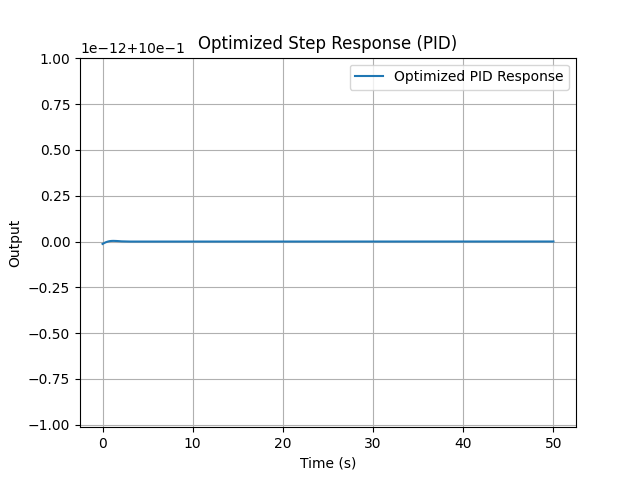
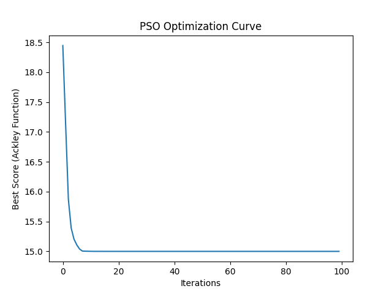
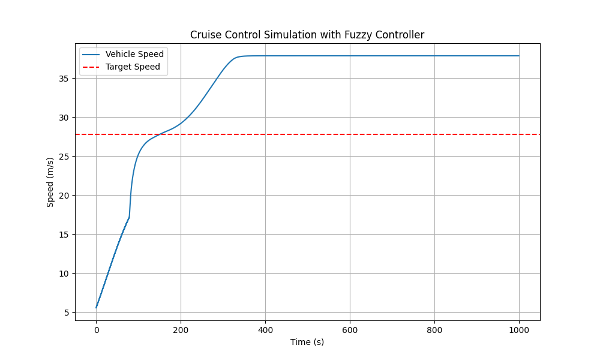
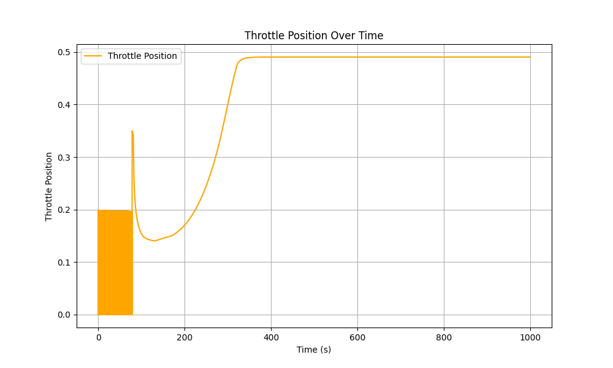

# HW3

## Overview
This project demonstrates the use of fuzzy logic and particle swarm optimization (PSO) for control system design. The implementation is divided into three main sections:

1. **Problem 1(a): Fuzzy Controller Design**
2. **Problem 1(b): PSO for PID Controller Optimization**
3. **Problem 2: Fuzzy Cruise Control Simulation**

## Problem 1(a): Fuzzy Controller Design

### Design
A fuzzy controller is designed to act like a PID controller, utilizing three input variables:
- `error`: The difference between the desired and actual output.
- `delta_error`: The rate of change of error.
- `integral_error`: The accumulation of error over time.

The output of the fuzzy controller is the `control_output`, which adjusts the system behavior.

#### Membership Functions
- **Error**:
  - Negative: [-1, -1, -0.5, 0]
  - Zero: [-0.5, 0, 0.5]
  - Positive: [0, 0.5, 1, 1]

- **Delta Error**:
  - Negative: [-0.5, -0.5, -0.25, 0]
  - Zero: [-0.25, 0, 0.25]
  - Positive: [0, 0.25, 0.5, 0.5]

- **Integral Error**:
  - Low: [0, 2.5, 5]
  - Medium: [2.5, 5, 7.5]
  - High: [5, 7.5, 10]

- **Control Output**:
  - Negative: [-1, -1, -0.5, 0]
  - Zero: [-0.5, 0, 0.5]
  - Positive: [0, 0.5, 1, 1]

#### Rules
1. If `error` is positive and `delta_error` is zero, then `control_output` is positive.
2. If `error` is negative and `delta_error` is negative, then `control_output` is negative.
3. If `error` is zero and `integral_error` is medium, then `control_output` is zero.
4. If `error` is positive and `integral_error` is high, then `control_output` is negative.
5. If `error` is negative and `integral_error` is low, then `control_output` is positive.

### Results
A fuzzy controller response was simulated over a range of error values, demonstrating its behavior.

## Problem 1(b): PSO for PID Controller Optimization

### Design
Particle Swarm Optimization (PSO) is used to tune the parameters of a PID controller (`Kp`, `Kd`, `Ki`) for a given plant.

#### Plant Transfer Function
- Numerator: [1]
- Denominator: [10, 1]

#### Performance Index
The performance index is based on:
1. Rise Time
2. Overshoot
3. Settling Time
4. Steady-State Error (SSE)

#### PSO Initialization
- Number of particles: 30
- Dimensions: 3 (Kp, Kd, Ki)
- Iterations: 100

### Results
The optimized PID parameters produced a step response with minimal overshoot and fast settling time.

## Problem 2: Fuzzy Cruise Control Simulation

### Design
A fuzzy controller is used to simulate cruise control for a vehicle. The controller adjusts throttle input based on:
1. Speed error (difference between desired and actual speed).
2. Change in speed error (rate of error).

#### Membership Functions
- **Error**:
  - Negative: [-50, -25, 0]
  - Zero: [-10, 0, 10]
  - Positive: [0, 25, 50]

- **Change in Error**:
  - Negative: [-10, -5, 0]
  - Zero: [-2, 0, 2]
  - Positive: [0, 5, 10]

- **Throttle**:
  - Low: [-0.1, 0.0, 0.5]
  - Medium: [0.2, 0.5, 0.8]
  - High: [0.5, 1.0, 1.0]

#### Rules
1. If `error` is negative and `d_error` is negative, then `throttle` is high.
2. If `error` is negative and `d_error` is zero, then `throttle` is medium.
3. If `error` is negative and `d_error` is positive, then `throttle` is low.
4. If `error` is zero and `d_error` is negative, then `throttle` is medium.
5. If `error` is zero and `d_error` is zero, then `throttle` is low.
6. If `error` is positive and `d_error` is positive, then `throttle` is low.

### Results
The cruise control system successfully adjusted the throttle to maintain a target speed of 100 km/h.

## Conclusion
This project demonstrates the integration of fuzzy logic and optimization techniques for control system design. The fuzzy controller provided PID-like behavior, and PSO successfully optimized the PID parameters for improved performance. The cruise control simulation highlights the practical application of fuzzy control in real-world systems.
